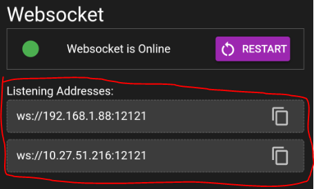
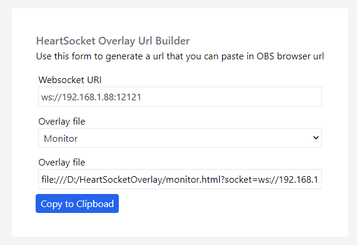
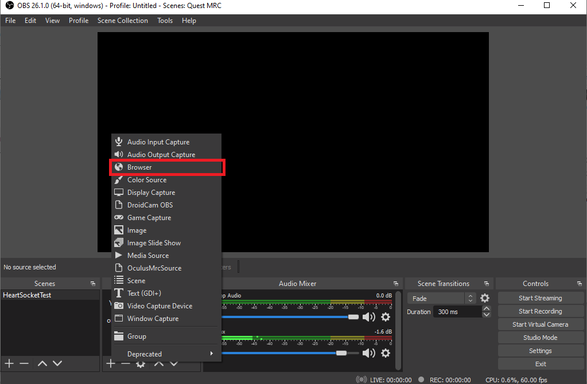
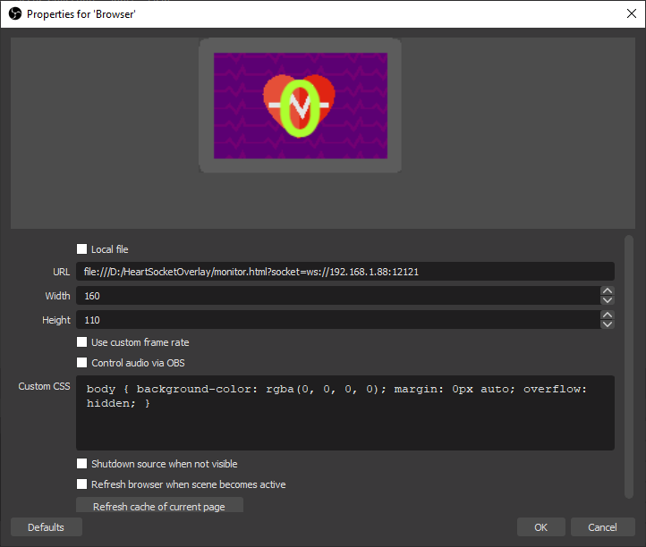

# HeartSocket Streaming Overlays
Sample HTML files for overlaying websocket heartrate monitor. 
These files are designed to work with the HeartSocket android app


## HeartSocket Android App
HeartSocket is an android app that relays/record Bluetooth Ble Heartrate monitors via websocket.
Initially build for my own personal use after i couldn't find a "free" app that does this.
The only free app that allows me to stream my heart rate in obs requires me to send my heart rate to an external service which i am not comfortable with - privacy and latency concern.

You can download it here: https://play.google.com/store/apps/details?id=com.collectskin.heartrate (APP NOT YET APPROVED BY GOOGLE PLAYSTORE)

Buy me a coffee :D

[](https://ko-fi.com/I2I01QMMF)


## Overlays
Currently there's 3 overlays available to use:
 * basic.html
 * beatsaber.html
 * monitor.html

The overlay html files gets the websocket uri via query string (socket url query param)
example:
```
<path>/basic.html?socket=<Your websock uri>
```

I have included a url builder to make your life easier (url_builder.html)


# Getting Started

Heartsocket Overlay is a collection of html files that you can use as heartrate overlays for your video streaming applications.

## Basic Requirements
Here is the list of things you need to get started with this overlay: 
 * Heartsocket Android app
 * The overlay files
 * A Wifi connection for your phone and computer
 * OBS Studio
 
## Step 1 Getting the Websocket URL
Launch the Heartsocket app and look for the section where it says "Listening Addresses"



In the case of this image, we have 2 listening addresses. 
We will pick the one that matches your computer's subnet, in our case its ws://192.168.1.88:12121
Note that this ip address might change overtime (depending on your router setup)

# Step 2 Overlay Url
I have included a "URL Builder" page in this repository, it will help with generating the overlay url.
Open the file "url_builder.html" with a webbrowser (only tested on chrome, please notify me if it doesn't work with other browsers)



Type in the "Websocket URI" from the step 1 then select the overlay you want to use and finally click on "Copy to clipboard"
Now to test if it is working or not. 
Do the following:
1) Open a new browser tab/window paste the url and hit enter.
2) In the app, select your make sure "Websocket is Online" - if not start it.
3) in the app, connect to your Bluetooth heartrate device
4) You should now see your heart rate in the browser


# Step 3 Setting up OBS
Now Launch OBS and add a new source


Now paste the the URL and adjust the width and height so that you can see the entire image (in this case width: 160, height: 110)



Press OK and now you have your overlay setup! 

# Technical details
Upon connection Heartsocket will start sending the current bpm that it gets from the bluetooth device.
The websocket data will only contain the heart rate.


## hr_websocket.js
I have included a very simple javascript class that you can use to establish connection and obtain the heart rate data.

Usage:
```
<script>
  // HeartSocket(websocket_uri, connectedCallback, disconnectedCallback, dataCallback)
  new HeartSocket('ws://192.168.1.88', connected, disconnected, getHeartRate)
</script>
```


# FAQ
* How do i know the size of the overlay?

Unfortunately when i was creating the overlays i did not think of making them responsive, the size is somewhat random because of that.
Here's the overlay size for each of the overlays:
  - basic.html width: 200, height: 200
  - monitor.html width: 160, height: 110
  - beatsaber.html width: 960, height: 480

* How do i make my own overlay?

Making your own overlay is relativly simple as long as you have some basic html/javascript knowledge (or shear will)
Start by looking/modifying basic.html then move on to beatsaber.html they should work as the basis of your overlay.
see the technical details part of this readme for more information

* Is it possible to do this without needing to be in the same wifi network?

Yes you can do this via a VPN (such as ZeroTier or Hamachi) and have both devices in the same vpn network, simply use the vpn ip address as listed as "listening address"


# Contributing & adding more overlays
I do not have any contribution guidelines as for now, just create a pull request, i'll approve it if i don't see any issue with it :3


# License

```
Copyright (c) 2021 ISIEO

Permission is hereby granted, free of charge, to any person obtaining a copy
of this software and associated documentation files (the "Software"), to deal
in the Software without restriction, including without limitation the rights
to use, copy, modify, merge, publish, distribute, sublicense, and/or sell
copies of the Software, and to permit persons to whom the Software is
furnished to do so, subject to the following conditions:

The above copyright notice and this permission notice shall be included in all
copies or substantial portions of the Software.

THE SOFTWARE IS PROVIDED "AS IS", WITHOUT WARRANTY OF ANY KIND, EXPRESS OR
IMPLIED, INCLUDING BUT NOT LIMITED TO THE WARRANTIES OF MERCHANTABILITY,
FITNESS FOR A PARTICULAR PURPOSE AND NONINFRINGEMENT. IN NO EVENT SHALL THE
AUTHORS OR COPYRIGHT HOLDERS BE LIABLE FOR ANY CLAIM, DAMAGES OR OTHER
LIABILITY, WHETHER IN AN ACTION OF CONTRACT, TORT OR OTHERWISE, ARISING FROM,
OUT OF OR IN CONNECTION WITH THE SOFTWARE OR THE USE OR OTHER DEALINGS IN THE
SOFTWARE.
```